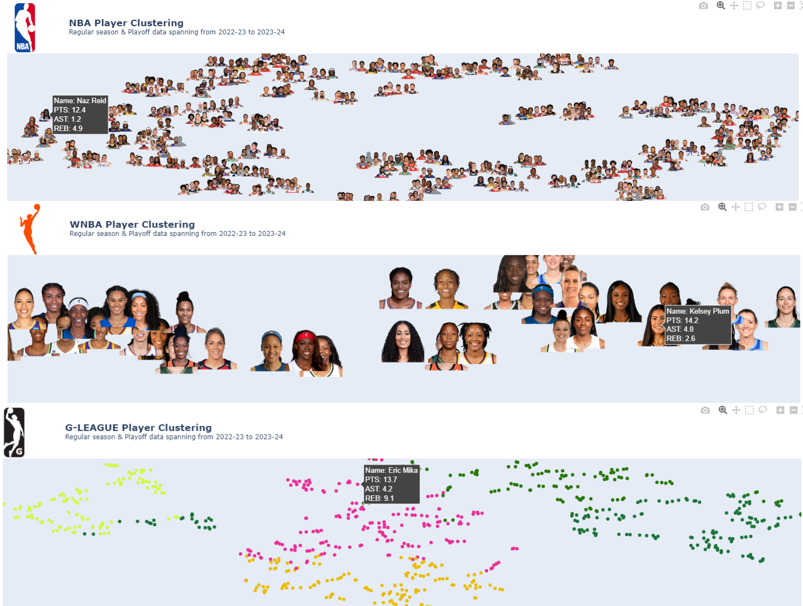

# Next Man Up: NBA Player Clustering for Talent Identification

Implemented clustering model to group NBA, WNBA, and G League players based on traditional and advanced box score statistics to:

1. Identify potential role player replacements
2. Scout emerging talent
3. Provide contingency planning for injuries and trades

Future improvement: Add NCAA player data.
